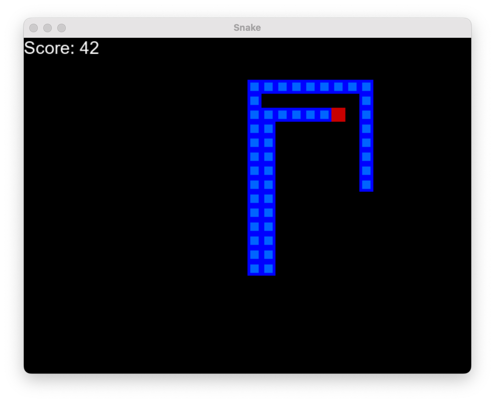
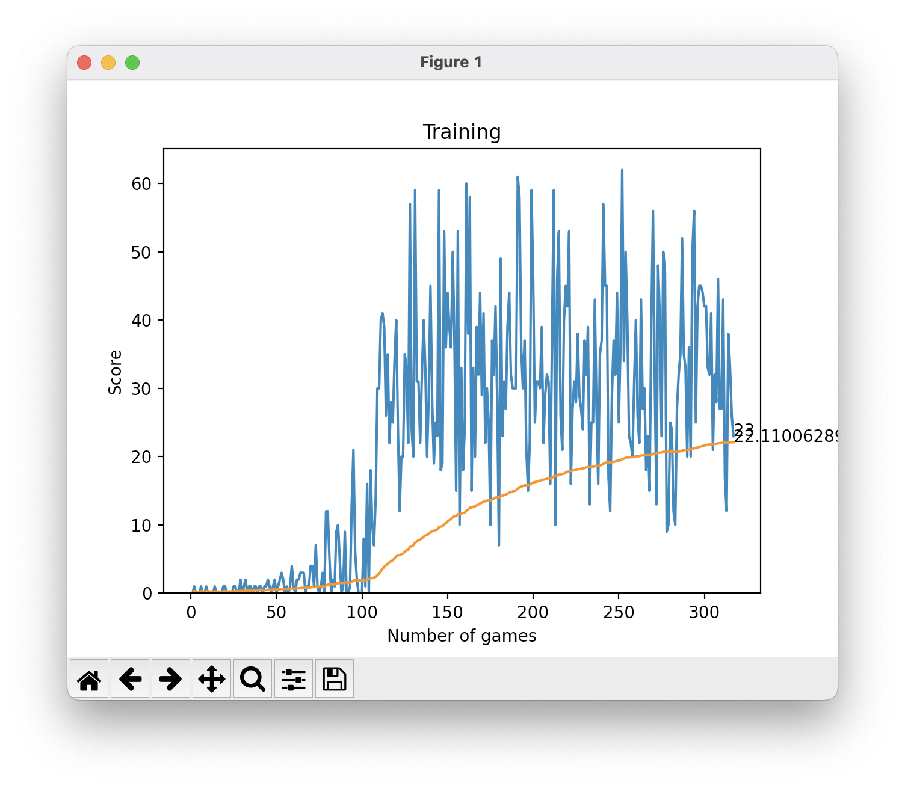

# PySnake AI - AI Playes Snake Game

This is simple pygame integration with Pytorch and Feed Foreward Neural Networks.
The following packages are required for the project to run properly.

This uses, [Bellman Equation](https://en.wikipedia.org/wiki/Bellman_equation) and [ReLU](https://en.wikipedia.org/wiki/Rectifier_(neural_networks)) for nn calculations and uses [back-propegation](https://en.wikipedia.org/wiki/Backpropagation).




## Dependencies

```
python=3.7
pygame
torch
torchvision
matplotlib
ipython
```

## Todo
1. Resolve the issues with self containing loop

## License
This code is under [MIT License](LICENSE). Its free to modify and distribute. ♥